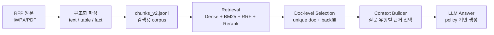

# RFP RAG RecallGuard 설계 요약

> 목표: **검색은 넓게, 답변은 엄격하게.**  
> RFP RAG에서 가장 큰 실패는 정답 문서를 아예 못 가져오는 것입니다. RecallGuard는 문서 회수율을 높이되, 답변 생성 단계에서 잘못된 근거 사용을 막도록 설계했습니다.

## 1. 전체 흐름

핵심은 retrieval과 generation의 역할을 분리한 것입니다.

- Retrieval: 정답 문서를 놓치지 않도록 넓게 찾는다.
- Generation: 검색된 모든 근거를 믿지 않고, metadata policy로 사용할 근거를 제한한다.

## 2. Corpus 설계

| Chunk / Metadata | 목적 | Generation 사용 원칙 |
|---|---|---|
| `document_identity` | 기관명, 사업명, 문서명, 공고번호, alias로 문서를 찾기 위한 anchor | 최종 답변 근거로 사용하지 않음 |
| `document_summary` | 문서의 핵심 후보를 빠르게 파악 | 보조 근거 |
| `project_budget`, `project_duration`, `bid_deadline` | 금액, 사업기간, 입찰마감일 등 핵심 fact | 질문 유형이 맞을 때만 사용 |
| `submission_documents`, `eligibility`, `business_type` | 제출서류, 자격요건, 사업유형 | 해당 질문에서 사용 |
| `threshold_budget`, `payment_terms` | 자격요건/지급조건 검색 보강 | 예산 답변에는 사용 금지 |

`document_identity`는 이번 RecallGuard의 핵심 추가점입니다.  
문서명을 정확히 입력하지 않거나 기관명/사업명이 살짝 깨진 질문에서도 정답 문서를 찾을 수 있도록 만든 **문서 식별 전용 chunk**입니다.

## 3. Retrieval 전략

검색 단계에서는 `embed_enabled=true`인 chunk만 Chroma에 적재합니다.

계속 제외하는 것:

- 목차 chunk
- 공란 서식
- 의미 없는 박스형 표
- low-signal table
- sparse / empty table
- low-confidence fact

넓게 포함하는 것:

- 문서 식별용 `document_identity`
- 제출서류, 자격요건, 사업유형
- 예산/기간/마감일 후보
- `threshold_budget`, `payment_terms` 같은 검색 보강 fact

최종 top5는 chunk 기준이 아니라 **문서 기준**으로 재구성합니다.

1. reranker는 기존처럼 chunk 단위로 수행
2. `source_file/doc_key` 기준으로 unique document 구성
3. 같은 문서의 여러 chunk가 top5를 독점하지 못하도록 제한
4. 문서 수가 부족하면 RRF/dense 후보에서 backfill
5. backfill된 근거는 `is_backfilled=true`로 표시

## 4. Generation 방어 장치

LLM은 검색된 context를 그대로 답변에 쓰지 않습니다.  
질문 유형과 metadata를 보고 사용할 근거를 제한합니다.

| 질문 유형 | 우선 사용 근거 |
|---|---|
| 예산 | `budget_answer_enabled=true` |
| 자격요건 | `eligibility_answer_enabled=true` |
| 지급조건 | `payment_answer_enabled=true` |
| 제출서류 | `submission_documents`, `submission_logistics` |
| 기간/마감일 | `project_duration`, `maintenance_period`, `warranty_period`, `bid_deadline` |

추가 규칙:

- `document_identity`는 문서 식별 신호이며 최종 숫자/날짜/금액 근거로 쓰지 않는다.
- `is_backfilled=true` context는 보조 근거로 낮은 우선순위를 둔다.
- 근거가 부족하면 추측하지 않고 `is_answerable=false`로 둔다.

## 5. 산출물 상태

| Corpus | 문서 수 | 검증 |
|---|---:|---|
| `parsing_p4_hwpx_125_datafix_recallguard` | 125 | PASS |
| `parsing_p4_hwpx_250_datafix_recallguard` | 250 | PASS |
| `parsing_p4_hwpx_690_datafix_recallguard` | 690 | PASS |

검증 완료 항목:

- `document_identity`가 문서당 1개 생성됨
- `document_identity`는 embed 대상
- `document_identity`의 answer-enabled flag는 모두 false
- 목차, low-signal table, low-confidence fact는 embed 제외
- manifest hash와 실제 chunks hash 일치

## 결론

RecallGuard는 RFP 도메인에 맞춘 **recall-first, policy-guarded RAG 구조**입니다.  
검색 단계에서는 정답 문서를 놓치지 않도록 넓게 회수하고, 생성 단계에서는 metadata policy로 답변 근거를 엄격하게 통제합니다.
